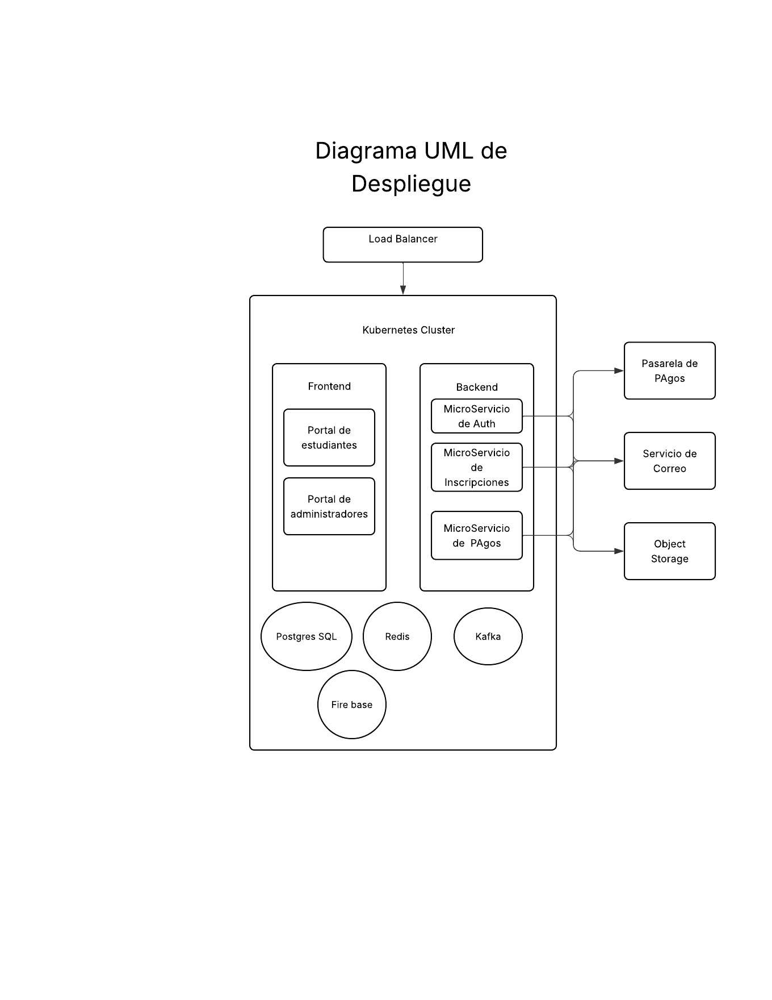

# README - Propuesta de Arquitectura para Sistema de Inscripciones y Pagos en Línea  

## Objetivo  
Rediseñar el sistema monolítico actual de inscripciones y pagos de la universidad hacia una **arquitectura SaaS escalable**, basada en **microservicios y microfrontends**, que garantice **escalabilidad, disponibilidad, seguridad y mantenibilidad**.  

---

##  Análisis Inicial  
### Requerimientos funcionales  
- Registro y gestión de alumnos
- Inscripción a cursos y control de cupos 
- Pagos en línea y reembolsos
- Gestión administrativa
- Notificaciones vía email/SMS/push

### Requerimientos no funcionales  
- Escalabilidad horizontal
- Alta disponibilidad (99.9%)  
- Seguridad
- Rendimiento 
- Mantenibilidad

---

## Modelado Arquitectónico Diagramas C4 

### Nivel 1: Context  
- Actores: Estudiantes, Administrativos, Pasarela de pagos, Servicio de notificaciones, Sistema Legacy.  
- Sistema central: **Plataforma de inscripciones y pagos**.  

### Nivel 2: Containers  
- **Frontends**:  
  - Portal Estudiantes
  - Portal Administrativos 
- **Backends**:  
  - API Gateway.  
  - Microservicios: Auth, Inscripciones, Pagos, Notificaciones, Catálogo.  
- **Infraestructura**:  
  - Postgres por servicio.  
  - Redis (cache).  
  - Kafka/RabbitMQ (eventos).  
  - Firebase.  

### Nivel 3: Components (ejemplo: Pagos MS)  
- API REST.  
- Adapter a pasarela externa.  
- Servicio de Reconciliación.  
- Repositorio de Pagos.  
- Publicador de eventos.  
- Handler.  

### Nivel 4: Code (UML simplificado de Pagos MS)  
- **PagoController** → recibe peticiones.  
- **PagoService** → lógica de negocio (iniciar/confirmar pagos, reconciliar).  
- **PagoRepository** → persistencia en Postgres.  

---

## UML de Despliegue (Cloud)  

- **Load Balancer** como punto de entrada.  
- **Cluster Kubernetes**:  
  - Namespace frontend (microfrontends).  
  - Namespace backend (API Gateway y microservicios).  
  - StatefulSet de Postgres.  
  - Redis y Kafka como soporte.  
- **Servicios externos**:  
  - Pasarela de pagos.  
  - Servicio de correo/SMS.  
  - Object Storage (S3).  

# Diagrama uml de dezpliegue

---

## Decisiones Arquitectónicas (ADR)  

1. **Microservicios vs Monolito** → Se adopta microservicios (mayor escalabilidad y despliegues desacoplados).  
2. **Base de Datos por Servicio vs Centralizada** → Se adopta database per service (aislamiento y escalabilidad).  
3. **JWT vs OAuth2/OpenID Connect** → Se adopta OAuth2 con tokens JWT (integración con SSO y proveedores externos).  

---

## Conclusión  
La propuesta plantea una arquitectura moderna, escalable y segura para el sistema universitario.  
Al aplicar **C4 + UML** y documentar decisiones técnicas con **ADRs**, se obtiene un diseño sólido, justificado y listo para ser implementado en la nube con Kubernetes y servicios gestionados.  

